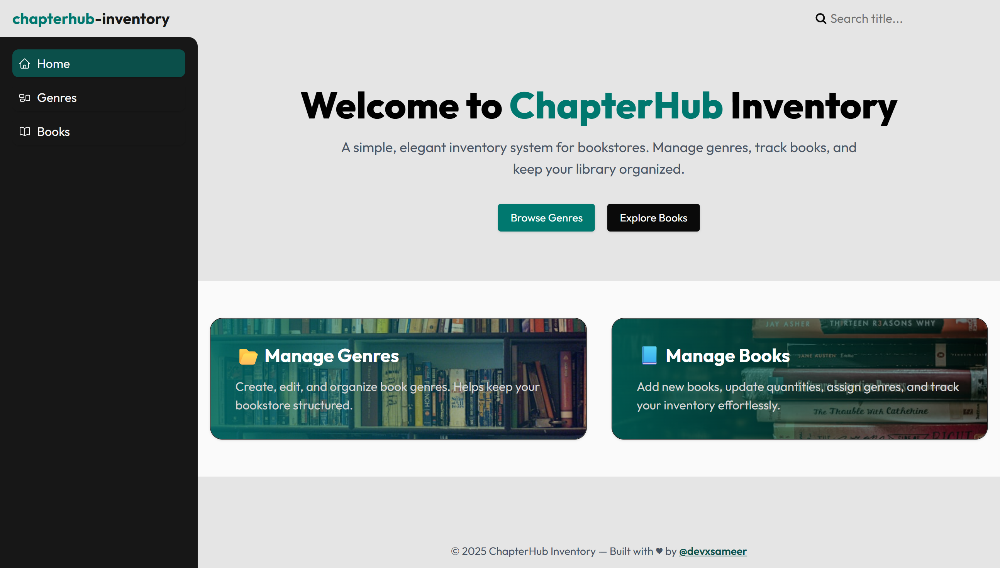
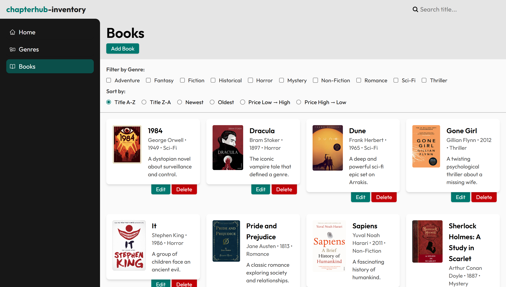
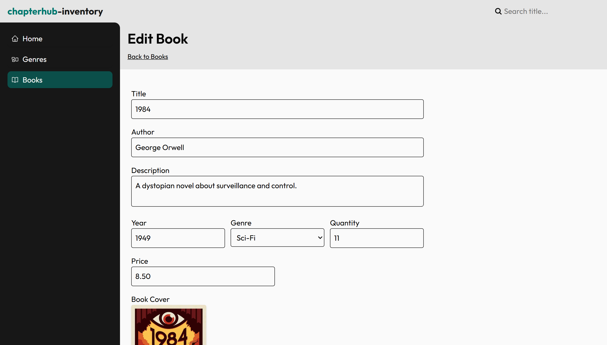
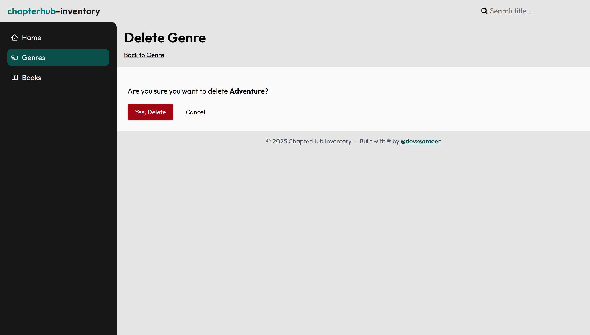
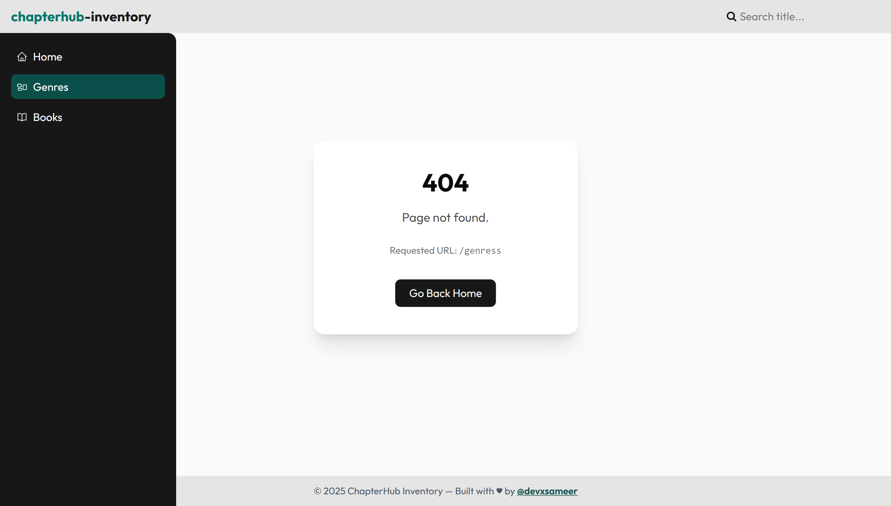

# 📚 ChapterHub Inventory

A full-stack **Express + PostgreSQL (Neon)** bookstore inventory application featuring **CRUD**, **image uploads**, **search**, **sorting**, **filtering**, and clean server-rendered views using **EJS + Tailwind CSS**.

Built as part of **The Odin Project**, but structured like a production-grade MVC application.

---

## 🚀 Live Demo

`Render`: [https://chapterhub-inventory.onrender.com/](https://chapterhub-inventory.onrender.com/)

---

## 🔖 Tech Stack & Tools


---

## 📸 Screenshots

### Home Page



### Books Page



### Edit Book Page



### Delete Genre Page



### Error Page



> Go to Live demo Section to see more pages - Error 500 Page, Edit Genre Page , Delete Book Page

---

# 🧰 Features

### 📖 Books Management

- Create, edit, delete books
- Upload cover images (Multer)
- Metadata support: title, author, year, description
- Additional fields: **price**, **quantity**
- Filename hashing using crypto
- Full validation with express-validator

### 📂 Genres Management

- Create, edit, delete genres
- Name + description fields
- Prevent duplicates using DB constraints
- Genre dropdown in book forms

### 🔍 Search, Filter & Sort

- Search books by title
- Filter books by **one or multiple genres**
- Sort options:
  - Title (A–Z / Z–A)
  - Year (Oldest / Newest)
  - Price (Low → High / High → Low)

### 📦 Database Layer

- PostgreSQL hosted on **Neon**
- Parameterized SQL queries (SQL injection safe)
- Modular queries for books & genres
- Seed script includes:
  - Schema generation
  - Sample genres & books
  - `--reset` mode
  - Index creation for genres

### 🎨 UI (Tailwind + EJS)

- Tailwind CSS v4
- Modern, minimal, responsive UI
- Clean EJS templates

---

# 🏗️ Tech Stack

### Backend

- Node.js
- Express 5
- Express Validator
- Multer (image uploads)
- PostgreSQL (Neon)

### Frontend

- EJS
- Tailwind CSS 4
- Vanilla JavaScript

### Dev Tools

- Nodemon
- Concurrently
- pnpm
- dotenv

---

# 📁 Folder Structure

```
chapterhub-inventory/
│
├─ app.js
├─ package.json
├─ nodemon.json
│
├─ db/
│   ├─ seed.js
│   ├─ pool.js
│   ├─ data/
│   │    ├─ books.js
│   │    └─ genres.js
│   └─ queries/
│        ├─ books.js
│        └─ genres.js
│
├─ controllers/
│   ├─ booksController.js
│   └─ genresController.js
│
├─ routes/
│   ├─ booksRouter.js
│   ├─ genresRouter.js
│   └─ indexRouter.js
│
├─ validators/
│   ├─ booksValidators.js
│   └─ genresValidators.js
│
├─ middlewares/
│   ├─ upload.js
│   └─ setLocals.js
│
├─ views/
│
└─ public/

```

---

# 🗄️ Database Schema

### **genres**

| Column      | Type          | Notes             |
| ----------- | ------------- | ----------------- |
| id          | identity (PK) | auto-generated    |
| name        | varchar(100)  | unique, required  |
| description | text          | optional          |
| created_at  | timestamptz   | defaults to NOW() |

### **books**

| Column                | Type                | Notes                 |
| --------------------- | ------------------- | --------------------- |
| id                    | identity (PK)       | auto-generated        |
| title                 | varchar(255)        | required              |
| author                | varchar(255)        | optional              |
| description           | text                | optional              |
| year                  | integer             | optional              |
| genre_id              | integer (FK)        | references genres(id) |
| image_url             | text                | uploaded path         |
| price                 | numeric(10,2)       | default 0             |
| quantity              | int                 | default 0             |
| created_at            | timestamptz         | defaults to NOW()     |
| UNIQUE(title, author) | prevents duplicates |

📌 Index:

```sql
CREATE INDEX idx_books_genre_id ON books(genre_id);
```

---

# ⚙️ Setup & Installation

### 1. Clone the repository

```bash
git clone https://github.com/devxsameer/chapterhub-inventory.git
cd chapterhub-inventory
```

### 2. Install dependencies

```bash
pnpm install
```

### 3. Create `.env`

```
DATABASE_URL=your_neon_connection_string
PORT=6969
```

### 4. Seed the database

Fresh reset:

```bash
pnpm seed:reset
```

Normal seed:

```bash
pnpm seed
```

---

# 🧪 Running the Project

### Development mode (server + Tailwind watcher)

```bash
pnpm dev
```

### Build Tailwind for production

```bash
pnpm css:build
```

### Start server normally

```
pnpm start
```

Server runs at:

```
http://localhost:6969
```

---

# 🖼️ Image Upload System

- Uploads stored in: `public/uploads/`
- Uses Multer disk storage
- Accepts: `.jpg`, `.jpeg`, `.png`, `.webp`
- Max file size: **5MB**
- Unique filenames using `crypto.randomBytes`

---

# 👨‍💻 Author

**Sameer Ali**  
Full-stack developer & Odin Project learner.

---

# 📝 License

**MIT License** — free to modify & share.
